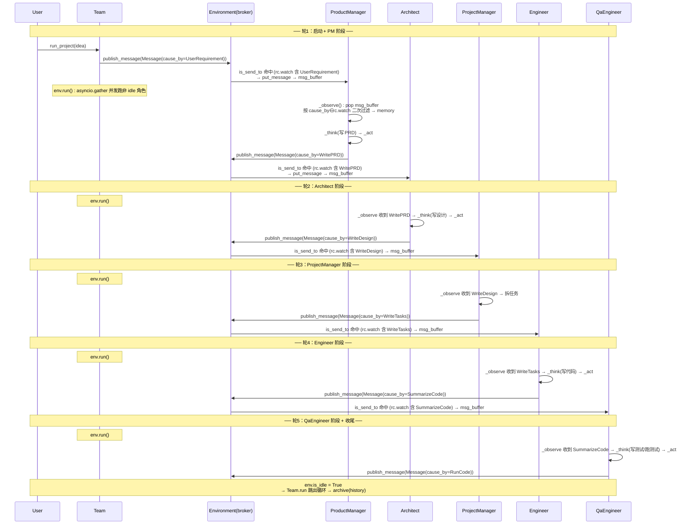

# MetaGPT 代码掌握指南

> 目标：帮助读者快速建立对 MetaGPT 项目的整体认知——核心抽象、执行流程、关键算法、关键交互，以及我们在此基础上构建的 SWE-bench 实验层。读完应能独立定位任意功能的代码位置。
>
> 行号基于当前仓库状态（2026/08/26），可能随提交漂移；文件链接可直达对应文件。

---

## 0. 项目定位与方法

- **论文**：*MetaGPT: Meta Programming for A Multi-Agent Collaborative Framework*（ICLR 2024）；关联论文 *Data Interpreter: An LLM Agent For Data Science*（arXiv 2402.18679），di/ 模块属后者一脉。
- **要解决的问题**：纯 LLM 多智能体做复杂软件工程时，自由对话引发**幻觉与级联错误**——agent 互相闲聊编造不接地气的中间产物，错误随轮次放大。
- **核心方法**：把人类软件公司的 **SOP（标准作业流程）编码进多智能体工作流**——结构化通信（角色间交换结构化文档而非自由闲聊）+ 角色分工（PM/Architect/Engineer…）。核心理念：`Code = SOP(Team)`。
- **输入输出**：一句话需求 → 完整软件产物（需求/架构/API/文档/代码）。

---

## 1. 核心抽象层（一图胜千言）

```
Team（团队容器）
 └─ Environment / MGXEnv（环境：消息总线）
     └─ Role × N（角色：含 RoleContext rc）
            ├─ rc.memory（消息记忆）
            ├─ rc.watch（订阅的 Action 标签集合）
            ├─ rc.todo（当前待执行 Action）
            ├─ Action / ActionNode（动作 + 结构化输出）
            └─ Tools：Terminal / Editor / LLM
Context（全局上下文：config + env + costs + roles registry）
```

### 1.1 Role（角色）
文件：[metagpt/roles/role.py](metagpt/roles/role.py)

- **主循环** `async def run(self, with_message=None)` → [role.py#L530-L553](metagpt/roles/role.py#L530-L553)：`_observe()` 拉新消息 → 无消息则等 → 否则 `react()`（think-act）→ `publish_message(rsp)`。
- **订阅** `_watch(actions)` → [role.py#L284-L288](metagpt/roles/role.py#L284-L288)：把关注的 Action 类写入 `self.rc.watch`。
- **观察过滤** `_observe()` → [role.py#L399-L427](metagpt/roles/role.py#L399-L427)：从 `rc.msg_buffer` 取消息，按 `n.cause_by in self.rc.watch or self.name in n.send_to` 过滤。
- **决策** `_think()` → [role.py#L340-L379](metagpt/roles/role.py#L340-L379)：单 Action 直接执行；多 Action 按 React/ByOrder/PlanAndAct 模式选下一个 state。
- **执行** `_act()`：执行 `rc.todo`，输出包成带 `cause_by=self.rc.todo` 的 Message 写入 `rc.memory` 并发布。

### 1.2 RoleContext（rc）
内嵌于 Role，持有：`memory`（Message 列表）、`watch`（Action 标签集）、`todo`、`state`、`msg_buffer`（环境推来的待消费消息）、`env`（环境引用）、`news`。`rc.memory.add(msg)` 是记忆写入入口。

### 1.3 Action / ActionNode
文件：[metagpt/actions/action.py](metagpt/actions/action.py)、[metagpt/actions/action_node.py](metagpt/actions/action_node.py)

- `Action` 基类：其**类名**即消息标签（`cause_by`），是订阅/路由的 key。
- `ActionNode`：结构化 LLM 输出机制——`ActionNode.create_model_class` 生成 pydantic 模型，`fill(req, llm)` 让 LLM 按字段返回结构化 JSON（抑制幻觉的核心手段）。
- `Message.cause_by` 默认 `UserRequirement`；`instruct_content` 校验兼容 `ActionNode`。

### 1.4 Team / Environment / Context
- [metagpt/team.py](metagpt/team.py)：团队容器。`hire(roles)` 注册角色 → [team.py#L83-L85](metagpt/team.py#L83-L85)；`run_project(idea)` 发布用户需求 → [team.py#L102-L107](metagpt/team.py#L102-L107)；`run(n_round)` 主循环 → [team.py#L122-L137](metagpt/team.py#L122-L137)。
- [metagpt/environment/base_env.py](metagpt/environment/base_env.py)：`add_roles` 注册并 `set_env` → [L164-L173](metagpt/environment/base_env.py#L164-L173)；`publish_message` 按地址匹配路由 → [L175-L195](metagpt/environment/base_env.py#L175-L195)；`run(k)` 并发跑非 idle 角色 → [L197-L211](metagpt/environment/base_env.py#L197-L211)。
- [metagpt/environment/mgx/mgx_env.py](metagpt/environment/mgx/mgx_env.py)：`MGXEnv` 在 base 之上加人类交互/TeamLeader 分发路由 → [L17-L57](metagpt/environment/mgx/mgx_env.py#L17-L57)。
- `Context`：全局上下文，持 `config`/`env`/`costs`/角色注册表，`Context().llm()` 取默认 LLM。

---

## 2. 两条执行路径

### Path A：MAS SOP 多智能体（SoftwareCompany）
入口：[metagpt/software_company.py#L14-L74](metagpt/software_company.py#L14-L74) 的 `generate_repo()`，经 typer CLI（`metagpt` 命令）调起。
```python
company = Team(context=ctx)
company.hire([TeamLeader(), ProductManager(), Architect(), Engineer2(), DataAnalyst()])
company.run_project(idea); asyncio.run(company.run(n_round=n_round, idea=idea))
```
职责：一句话 idea → 完整软件项目（greenfield 造软件）。

### Path B：单 Agent（RoleZero / Engineer2 直接 run）
不走 Team/Environment，代码里直接实例化单角色并 `run(with_message=issue)`。消息直接喂入，不经环境总线。**我们 SWE-bench 实验用的就是这条**（详见 §6）。

---

## 3. 关键算法

### 3.1 环境消息路由（publish/subscribe）
1. 角色注册：`env.add_role(role)` → `role.set_env(env)` → `env.set_addresses(role, role.addresses)`。
2. 角色订阅：`role._watch([ActionA, ActionB])` → `rc.watch = {ActionA, ActionB}`（`any_to_str` 转换类名为字符串）。
3. 消息发布：`role.publish_message(msg)` → `env.publish_message(msg)`。
4. 路由匹配：`is_send_to(msg, addrs)`——若 `msg.send_to` 含 `<all>` 或与 `addrs` 有交集，则 `env.put_message(role, msg)` 写入 `role.rc.msg_buffer`。
5. 消费：角色下一轮 `_observe()` 从 `msg_buffer` 取出新消息处理。

**标签即契约**：消息的 `cause_by`（发出它的 Action 类）决定谁能收到。织出协作图的本质就是配置每个角色的 `_watch` 集合。

### 3.2 MAS 一轮调度（Team.run）
[team.py#L122-L137](metagpt/team.py#L122-L137)
```python
while n_round > 0 and not env.is_idle:
    n_round -= 1
    await env.run()              # 并发跑所有非 idle 角色
env.archive(auto_archive)       # 归档历史
```
`env.run()` 并发 `await asyncio.gather(*futures)` 每个非 idle 角色；`is_idle` 判定所有角色都无新消息可处理（`role.is_idle`）。一轮内所有角色并发观察-思考-行动-发布，下一轮各自收到对方发布的消息。

### 3.3 Role 的 think-act 循环（经典 React）
[role.py#L530-L553](metagpt/roles/role.py#L530-L553)（基类 Role）
```
run(with_message):
    if with_message: put_message(msg); msg.cause_by = UserRequirement
    if not await _observe(): return  # 无新消息则等待
    rsp = await react()   # _think 选 todo → _act 执行
    self.set_todo(None)
    publish_message(rsp)
```

[role.py#L303-L336](metagpt/roles/di/role_zero.py#L303-L336)（RoleZero 重写了 `_react`）：
- 每次进入 `_react` 先 `_set_state(0)` 允许处理新闻
- `_quick_think()` 先快速判断是否有简单问题可立即回答
- 主循环内每次 `act` 后仍调用 `_observe()` 持续感知新消息
- 达到 `max_react_loop`（默认 50）时询问人类是否继续

### 3.4 RoleZero 的 LLM 命令分发（单 agent 核心引擎）
RoleZero 是 MetaGPT 新一代"零预设角色"agent——不靠固定 Action 序列，而是用 LLM 动态决策调用哪个工具命令。文件：[metagpt/roles/di/role_zero.py](metagpt/roles/di/role_zero.py)。

**_think（构建决策 prompt → 调 LLM）** [role_zero.py#L198-L265](metagpt/roles/di/role_zero.py#L198-L265)：
1. **Experience**：`_retrieve_experience()` 从经验池召回相似案例。
2. **Plan Status**：`get_plan_status(planner)` 取当前任务/计划状态。
3. **Tool/Command Info**：`tool_recommender.recommend_tools()` 推荐可用工具，`json.dumps({name: schemas})`。
4. **Instruction**：角色自身指令。
5. 组装 `system_prompt`（role_info + available_commands + example + instruction）+ `cmd_prompt`（current_state + plan_status + current_task）。
6. **Recent Observation**：`rc.memory.get(memory_k)` 近期记忆，经 `parse_browser_actions`/`parse_editor_result`/`parse_images` 清洗。
7. `llm_cached_aask(req, system_msgs)` → [L268-L274](metagpt/roles/di/role_zero.py#L268-L274)（带 `exp_cache` 经验管理）→ `self.command_rsp`（LLM 返回的命令 JSON）。
8. `check_duplicates` 去重，避免重复执行相同命令。

**_act（解析命令 → 分发执行）** [role_zero.py#L280-L294](metagpt/roles/di/role_zero.py#L280-L294)：
- `parse_commands(command_rsp)` 解析 LLM 输出为命令列表。
- `rc.memory.add(AIMessage(command_rsp))`。
- `await self._run_commands(commands)`。

**_run_commands（命令分发）** [role_zero.py#L385-L415](metagpt/roles/di/role_zero.py#L385-L415)：
```python
for cmd in commands:
    if _is_special_command(cmd):       # 特殊命令
        _run_special_command(cmd)
    elif cmd["command_name"] in tool_execution_map:   # 普通工具命令
        tool_obj = tool_execution_map[command_name]
        tool_obj(**cmd["args"])        # 同步/异步自适应
    else: "not found"; break
```

**特殊命令** [role_zero.py#L420-L447](metagpt/roles/di/role_zero.py#L420-L447)：
- `Plan.finish_current_task`：标记当前计划任务完成。
- `end`：调 `self._end()` 停止角色。
- `RoleZero.ask_human`：问人类（eval 模式重绑到 `_end`）。
- `Terminal.run_command`：跑终端命令 + `format_terminal_output` 装饰。

**普通命令** 经 `tool_execution_map`——一个 `{command_name: 可调用对象}` 字典，把 LLM 的字符串命令映射到工具方法（如 `Editor.write`、`Editor.edit_file_by_replace` 等）。这就是 LLM 文本输出 → 代码方法调用的桥梁。

### 3.5 Planner / Plan（任务分解）
[metagpt/strategy/planner.py](metagpt/strategy/planner.py)

RoleZero 持 `self.planner`，`planner.plan` 有 `goal` 和任务列表。LLM 可通过 `Plan.append_task` 之类命令把大目标拆成子任务，`finish_current_task` 标记进度。`get_plan_status` 把计划状态回灌进下一轮 `_think` 的 prompt，形成"计划驱动"的闭环。

**Plan 类** [schema.py#L496-L710](metagpt/schema.py#L496-L710)：
- `append_task(task_id, dependent_task_ids, instruction, assignee, task_type)`：追加任务
- `finish_current_task()`：标记当前任务完成
- `is_plan_finished()`：判断计划是否完成
- `current_task`：获取当前任务

**Command 枚举** [strategy/thinking_command.py#L19-L68](metagpt/strategy/thinking_command.py#L19-L68)：
- 规划命令：`append_task`, `reset_task`, `replace_task`, `finish_current_task`
- 环境交互：`publish_message`, `reply_to_human`, `ask_human`
- 通用命令：`pass`

### 3.6 LLM Provider 链
1. **配置加载** [config2.py#L101-L123](metagpt/config2.py#L101-L123)：`from_home()` 读 `~/.metagpt/config2.yaml`，`LLMConfig` 持 `api_type`/`model`/`api_key`/`base_url` → [llm_config.py#L19-L64](metagpt/configs/llm_config.py#L19-L64)。
2. **工厂** [llm.py#L15-L20](metagpt/llm.py#L15-L20)：`LLM()` 无参时用 `Context().llm()`。
3. **注册表** [llm_provider_registry.py#L12-L48](metagpt/provider/llm_provider_registry.py#L12-L48)：`register_provider` 装饰器按 `LLMType` 注册 provider 类；`create_llm_instance(config)` 用 `config.api_type` 查表实例化。
4. **调用**：`self.llm.aask(req, system_msgs)` 同步接口；RoleZero 经 `llm_cached_aask` 包一层 `exp_cache`。
5. provider 子目录：`openai_api.py`、`anthropic.py`、`zhipuai.py`、`gemini.py` 等，均继承 `BaseLLM`/`BaseProvider`。

**不依赖 litellm**：MetaGPT 自有 provider 栈，按 `api_type` 选 provider。本次实验用 `openai_api` provider 跑 Deepseek-V4-Flash-0731。

---

## 3.7 多 Agent 协作设计详解（发布订阅架构）

**设计本质：是的，就是发布-订阅（pub-sub）消息总线**。`Environment` 是 broker（消息代理），消息的 `cause_by`（发出该消息的 Action 类名字符串）就是 **routing key（路由键）**，每个角色在 `rc.watch` 里登记自己订阅的 Action 标签，broker 据此把消息投递到目标角色的私有 buffer。织出协作图的本质，就是配置每个角色的 `_watch` 集合。

### 3.7.1 关键数据结构

**① `Message`**（消息包）— [schema.py#L232-L302](metagpt/schema.py#L232-L302)

| 字段 | 类型 | 作用 |
|---|---|---|
| `id` | str | 消息唯一标识（UUID），默认自动生成 |
| `content` | str | 自然语言正文（人或 agent 的文本） |
| `instruct_content` | Optional[BaseModel] | 结构化输出（`ActionNode` 生成的 pydantic 模型） |
| `role` | str | 角色标识（system/user/assistant），默认 user |
| **`cause_by`** | str | **路由键**——发出该消息的 Action 类名字符串（默认 `UserRequirement`） |
| `sent_from` | str | 发送者身份（角色名/类名） |
| `send_to` | set[str] | 直接送达地址，默认 `{MESSAGE_ROUTE_TO_ALL}`（`"<all>"`） |
| `metadata` | Dict | 附加元数据 |

`cause_by` 经 `check_cause_by` 校验：传 Action 类会自动 `any_to_str` 转成类名字符串 → [schema.py#L266-L269](metagpt/schema.py#L266-L269)。

**② `RoleContext`（`rc`，角色上下文）** — [role.py#L92-L123](metagpt/roles/role.py#L92-L123)

| 字段 | 作用 |
|---|---|
| `env` | 环境引用（BaseEnvironment） |
| `msg_buffer` | 私有消息队列——broker 路由进来的待消费消息（MessageQueue） |
| `memory` | 已消费的消息记忆（Memory，按序存） |
| `working_memory` | 工作记忆（每个 task 独立） |
| **`watch`** | **订阅的 Action 标签集合**（`set[str]`），由 `_watch` 设置 |
| `todo` | 当前待执行 Action |
| `state` | 状态机状态（-1 表示初始/终止状态） |
| `news` | 上一轮 `_observe` 过滤出的"感兴趣的新消息" |
| `react_mode` | 反应模式（REACT/BY_ORDER/PLAN_AND_ACT） |
| `max_react_loop` | 最大反应循环次数 |

**③ `Environment.member_addrs`** — 订阅表 `dict[role, set[str]]`：每个角色登记的地址集合（默认含自身 name/profile 标签），broker 路由时遍历它 → [base_env.py#L240-L242](metagpt/environment/base_env.py#L240-L242)。

**④ 路由常量** — [const.py#L77-L83](metagpt/const.py#L77-L83)：
- `MESSAGE_ROUTE_TO_ALL = "<all>"`（广播）
- `MESSAGE_ROUTE_TO_SELF = "<self>"`（回环）
- `any_to_str(ActionClass)` → 该 Action 的类名字符串（[common.py#L395](metagpt/utils/common.py#L395)）——这是把"Action 类"转成"路由标签"的桥梁。

**⑤ `is_send_to`** — [common.py#L423-L431](metagpt/utils/common.py#L423-L431)：
```python
def is_send_to(message, addresses):
    if MESSAGE_ROUTE_TO_ALL in message.send_to:  # 广播
        return True
    for i in addresses:
        if i in message.send_to:  # 地址命中
            return True
    return False
```

### 3.7.2 三阶段流程（订阅注册 → 发布路由 → 消费观察）

**阶段 1：订阅注册（角色入环境时）**

```
env.add_role(role)                         # base_env L164-L173
  └─ role.set_env(env)                     # role L308-L316
       └─ env.set_addresses(role, role.addresses)   # 把角色地址写入 member_addrs
# 同时角色在自己 __init__ 里已调：
role._watch([ActionA, ActionB])            # role L284-L288 → rc.watch = {any_to_str(ActionA), ...}
```
- `_watch` → [role.py#L284-L288](metagpt/roles/role.py#L284-L288)：`rc.watch = {any_to_str(t) for t in actions}`。
- `set_addresses` → [base_env.py#L240-L242](metagpt/environment/base_env.py#L240-L242)：`member_addrs[obj] = addresses`。

**阶段 2：发布路由（角色发出消息）**

角色侧 `publish_message` → [role.py#L429-L446](metagpt/roles/role.py#L429-L446)：
```python
def publish_message(self, msg):
    if MESSAGE_ROUTE_TO_SELF in msg.send_to:   # <self> → 补自己地址
        msg.send_to.add(any_to_str(self)); msg.send_to.remove(MESSAGE_ROUTE_TO_SELF)
    if not msg.sent_from or msg.sent_from == MESSAGE_ROUTE_TO_SELF:
        msg.sent_from = any_to_str(self)
    if all(to in {any_to_str(self), self.name} for to in msg.send_to):  # 给自己 → 本地回环
        self.put_message(msg); return
    if not self.rc.env: return                  # 无环境 → 丢弃
    self.rc.env.publish_message(msg)           # → 交给 broker
```

broker 侧 `Environment.publish_message` → [base_env.py#L175-L195](metagpt/environment/base_env.py#L175-L195)：
```python
def publish_message(self, message):
    found = False
    for role, addrs in self.member_addrs.items():   # 遍历订阅表
        if is_send_to(message, addrs):              # 路由键命中？
            role.put_message(message)               # → role.rc.msg_buffer
            found = True
    if not found: logger.warning("Message no recipients")
    self.history.add(message)   # 归档
```

**阶段 3：消费观察（下一轮角色拉取）**

`_observe` → [role.py#L399-L427](metagpt/roles/role.py#L399-L427)：
```python
async def _observe(self) -> int:
    news = []
    if self.recovered and self.latest_observed_msg:
        news = self.rc.memory.find_news(observed=[self.latest_observed_msg], k=10)
    if not news:
        news = self.rc.msg_buffer.pop_all()       # 取出 broker 投递来的消息
    old_messages = [] if not self.enable_memory else self.rc.memory.get()
    self.rc.news = [
        n for n in news
        if (n.cause_by in self.rc.watch or self.name in n.send_to)  # 二次过滤
        and n not in old_messages
    ]
    self.rc.memory.add_batch(self.rc.news)    # 存入记忆
    self.latest_observed_msg = self.rc.news[-1] if self.rc.news else None
    return len(self.rc.news)
```
**双重过滤**：broker 已按 `addresses` 投递一次，`_observe` 再按 `cause_by in rc.watch` 或 `send_to` 命中 name 过滤一次——确保只处理真正感兴趣的 Action 消息。`_observe` 返回 `news` 数量，0 则角色本轮 idle。

### 3.7.3 并发调度模型

`Environment.run(k)` → [base_env.py#L197-L211](metagpt/environment/base_env.py#L197-L211)：
```python
async def run(self, k=1):
    for _ in range(k):
        futures = []
        for role in self.roles.values():
            if role.is_idle:
                continue
            future = role.run()
            futures.append(future)
        if futures:
            await asyncio.gather(*futures)   # 并发跑所有非 idle 角色
```
- **一轮内所有非 idle 角色并发执行**（asyncio.gather），各自走 `_observe → _think → _act → publish_message`。
- `is_idle` → [base_env.py#L228-L234](metagpt/environment/base_env.py#L228-L234)：所有角色都 idle 才返回 True（`Team.run` 据此决定是否提前结束）。
- 上一轮 A 发布的消息，下一轮 B 的 `_observe` 才能收到——**跨轮次消息驱动协作**（同轮内 A 发布、B 不一定同轮收到，取决于 gather 完成时序）。

### 3.7.4 实例：SOP 消息协作链（SoftwareCompany）

各角色的真实 `_watch` 集（代码里硬编码，非配置文件）：

| 角色 | `_watch`（订阅的 Action） | 产出消息（`cause_by`） |
|---|---|---|
| ProductManager | `[UserRequirement, PrepareDocuments]` → [product_manager.py#L46](metagpt/roles/product_manager.py#L46) | `WritePRD` |
| Architect | `{WritePRD}` → [architect.py#L52](metagpt/roles/architect.py#L52) | `WriteDesign` |
| ProjectManager | `[WriteDesign]` → [project_manager.py#L41](metagpt/roles/project_manager.py#L41) | `WriteTasks` |
| Engineer / Engineer2 | `[WriteTasks, SummarizeCode, WriteCode, WriteCodeReview, FixBug, WriteCodePlanAndChange]` → [engineer.py#L106](metagpt/roles/engineer.py#L106) | `WriteCode` |
| QaEngineer | `[SummarizeCode, WriteTest, RunCode, DebugError]` → [qa_engineer.py#L59](metagpt/roles/qa_engineer.py#L59) | `WriteTest`/`RunCode` |
| TeamLeader | `[UserRequirement, WritePRD, WriteDesign, WriteTasks]` → [team_leader.py#L48](metagpt/roles/di/team_leader.py#L48) | 协调/分发 |

Action 类见 [metagpt/actions/](metagpt/actions/)：`UserRequirement`、`WritePRD`、`WriteDesign`、`WriteCode`、`WriteTest`、`RunCode` 等。

**消息流转（一次 SOP 协作）**：

```
轮1  Team.run_project(idea)
       └─ env.publish_message(Message(content=idea, cause_by="UserRequirement"))
            └─ broker 路由：ProductManager 的 rc.watch 含 "UserRequirement" → 命中 → 投 PM.msg_buffer

轮1  env.run()  (asyncio.gather 并发)
       └─ ProductManager.run(): _observe 收到 UserRequirement
            → _think(写 PRD) → _act 产出 Message(cause_by="WritePRD")
            → publish_message → broker 路由：Architect.rc.watch 含 "WritePRD" → 投 Architect.msg_buffer

轮2  env.run()
       └─ Architect.run(): _observe 收到 WritePRD
            → 写设计 → publish(cause_by="WriteDesign") → 投 ProjectManager.msg_buffer

轮3  ProjectManager 收 WriteDesign → 产出 WriteTasks → 投 Engineer.msg_buffer

轮4  Engineer 收 WriteTasks → 写代码 → publish(cause_by="SummarizeCode") → 投 QaEngineer.msg_buffer

轮5  QaEngineer 收 SummarizeCode/WriteTest → 跑测试 → publish(RunCode/DebugError)
```

**协作图（订阅边）**：

```
UserRequirement ──→ ProductManager ──WritePRD──→ Architect
                                                   │
                                          WriteDesign
                                                   ▼
                                              ProjectManager
                                                   │
                                          WriteTasks
                                                   ▼
              QaEngineer ←──SummarizeCode── Engineer ──┘
                   │
              WriteTest/RunCode
```

每条边 = "下游角色的 `rc.watch` 含上游产出的 Action 标签"。改协作图 = 改 `_watch`。

### 3.7.5 设计要点与权衡

1. **标签即契约（loosely-coupled）**：角色不直接调对方方法，只约定"我产出 `WritePRD`、你订阅 `WritePRD`"。换实现不影响协作——换 PM 的 PRD 生成方式，Architect 不用改。
2. **结构化抑制幻觉**：`instruct_content`（`ActionNode` 模型）让消息正文是结构化 pydantic 对象而非自由文本，下游按字段解析，这是 MetaGPT 论文"结构化通信降幻觉"的落点。
3. **广播 vs 定向**：默认 `send_to={<all>}` 广播给所有订阅者；也可 `send_to={specific_role_name}` 定向。`<self>` 走本地回环（不经 broker）。
4. **二次过滤**：broker 按 `member_addrs` 投递，`_observe` 再按 `rc.watch` 过滤——`member_addrs` 默认含角色自身标签，所以"能收到"≠"会处理"，最终由 `rc.watch` 决定角色真反应哪些消息。
5. **跨轮驱动**：消息经 broker 异步投递，协作天然跨轮次；同轮并发但消息依赖跨轮，这与"自由闲聊"不同——SOP 的顺序性由 `_watch` 图的拓扑保证。
6. **history 归档**：`env.history.add(msg)` 记录所有消息，便于 debug 与 `archive`。
7. **RoleZero 的特殊设计**：不走 `_watch` 订阅，而是 `observe_all_msg_from_buffer=True`，通过 `max_react_loop` 循环和 `_quick_think` 动态决策。

> 对照单 Agent（§3.4 RoleZero）：单 agent 不经 broker，消息经 `run(with_message)` 直接灌入 `rc.memory`，自己跟自己循环。MAS 的核心区别就是"多角色共享 broker + 各自 `_watch` 织订阅图"。

### 3.7.6 SOP 5 轮消息流转时序图

下图为 SoftwareCompany 的 SOP 协作时序（Mermaid，支持 GitHub/VSCode 预览/Typora 等渲染）：



**读图要点**：
- **实线箭头 `→`**：方法调用/消息发布；`Environment(broker)` 是中枢，所有跨角色消息都经它路由。
- **每个角色的内部框**：`_observe → _think → _act → publish` 四步闭环，即 §3.3 的 think-act 循环。
- **跨轮依赖**：轮 N 发布的消息，轮 N+1 的 `_observe` 才消费（broker 异步投递 + `env.run` 每轮 gather 一次）。
- **订阅即路由键**：`E→PM` 的命中条件 `rc.watch 含 UserRequirement` 等即 `cause_by` 匹配 `rc.watch`（§3.7.1）。
- **轮4→轮5 真实衔接**：Engineer 产出 `SummarizeCode`（而非 `WriteCode`），因 `QaEngineer._watch` 含 `SummarizeCode` → [qa_engineer.py#L59](metagpt/roles/qa_engineer.py#L59)，比 §3.7.4 表格简化版更准。

---

## 4. 工具子系统（RoleZero 命令的真实落点）

### 4.1 Terminal
文件：[metagpt/tools/libs/terminal.py](metagpt/tools/libs/terminal.py)
- `run_command(cmd)`：两种模式——持久 shell（本地）或 **docker exec**（读 `SWE_USE_DOCKER`/`SWE_DOCKER_CONTAINER`/`SWE_DOCKER_CWD` 环境变量）。
- **marker 捕获**：命令尾部追加唯一 marker，读到 marker 行即认为输出结束——用于异步流式输出判界（早期在此处死锁过，已修 splitlines 逻辑）。

### 4.2 Editor（容器化的核心）
文件：[metagpt/tools/libs/editor.py](metagpt/tools/libs/editor.py)
- **容器化字段**：`docker_container`、`docker_cwd`。
- **IO 原语（本地/docker 双模式）**：
  - `_is_docker()`、`_docker_exec(cmd)`：`docker exec -w {cwd} {container} bash -lc "{cmd}"`。
  - `_read_file(path)`：docker → `cat`；本地 → `open`。
  - `_write_file(path, content)`：docker → `docker exec -i ... cat > path`（stdin 灌内容）；本地 → `open(w)`。
  - `_file_exists`/`_file_size`/`_is_dir`/`_mkdir`：test/even 同理。
- **上层方法**（都调原语）：`write`、`read`、`open_file`、`search_dir`、`search_file`、`_edit_file_impl`、`edit_file_by_replace`。
- **`_lint_file`**：docker 模式下把容器内文件读到本地临时文件，调 `Linter`，再把路径回填；外层 try/except 兜底防 tree-sitter 兼容异常阻塞编辑。
- **路径处理**：`_try_fix_path` 在 docker 模式下不做本地映射（路径直接以容器 `/testbed` 为根）。

### 4.3 Linter
文件：[metagpt/tools/libs/linter.py](metagpt/tools/libs/linter.py)：`Linter(root).lint(path)`，基于 tree-sitter 做 Python 语法/错误检查，返回 `lint_error.text` + `lint_error.lines`。

---

## 5. ActionNode 结构化输出机制

### 5.1 核心流程

`ActionNode` 是 MetaGPT 抑制 LLM 幻觉的核心机制——通过强制 LLM 输出结构化 JSON 来保证下游可解析。

**创建模型类** [action_node.py#L248-L282](metagpt/actions/action_node.py#L248-L282)：
```python
@staticmethod
def create_model_class(class_name: str, mapping: dict) -> type[BaseModel]:
    """从 field_name -> (type, default) mapping 创建 pydantic 模型"""
    return create_model(class_name, **{
        k: (v[0], Field(default=v[1])) for k, v in mapping.items()
    })
```

**填充内容** [action_node.py#L597-L663](metagpt/actions/action_node.py#L597-L663)：
```python
async def fill(self, *, req, llm, schema="json", mode="auto", strgy="simple", ...):
    self.set_llm(llm)
    self.set_context(req)
    if strgy == "simple":
        return await self.simple_fill(schema=schema, mode=mode, ...)
    elif strgy == "complex":
        # 复杂模式：每个子节点分别填充
        ...
```

### 5.2 使用示例

```python
from metagpt.actions.action_node import ActionNode

# 定义节点
node = ActionNode(
    key="WRITE_CODE",
    expected_type=str,
    instruction="Write the Python code for the specified file path",
    example='```python\ndef hello(): print("world")\n```',
    schema="markdown"
)

# 填充（调用 LLM）
result = await node.fill(req="Write a hello world function", llm=my_llm)

# 获取结构化输出
code = result.instruct_content  # 是一个 pydantic 模型实例
```

### 5.3 关键字段说明

| 字段 | 作用 |
|---|---|
| `key` | 节点标识，也作为生成模型类的字段名 |
| `expected_type` | 期望的 Python 类型（str/list/dict 等） |
| `instruction` | 给 LLM 的指令 |
| `example` | 输出示例，帮助 LLM 理解格式 |
| `schema` | 输出格式（json/markdown/raw） |
| `instruct_content` | LLM 填充后的 pydantic 模型实例 |

---

## 6. 关键交互序列

### 6.1 MAS 一轮（Path A）
```
Team.run_project(idea)
  └─ env.publish_message(Message(content=idea, cause_by=UserRequirement))   # 广播需求
Team.run(n_round)
  └─ env.run()                          # 并发
       ├─ PM.run(): _observe(收到UserRequirement) → _think(写PRD) → _act → publish(PRDMessage, cause_by=WritePRD)
       ├─ Architect.run(): _observe(收到WritePRD) → _think(写设计) → _act → publish(DesignMessage, cause_by=WriteDesign)
       └─ Engineer2.run(): _observe(收到WriteDesign) → _think(写代码) → _act → publish(CodeMessage)
  └─ 下一轮：各角色按 _watch 收到对方发布的新消息继续
```

### 6.2 单 Agent 一次 think-act（Path B，我们 SWE-bench 用的）
```
engineer.run(with_message=issue)
  └─ _observe(): rc.memory.add(issue); rc.todo = 首个 Action
  └─ _react() 循环（≤ max_react_loop）:
       ├─ _think(): experience + plan_status + tool_info + memory → llm_cached_aask → command_rsp（JSON 命令）
       └─ _act(): parse_commands → _run_commands:
            ├─ Terminal.run_command(cmd)   # docker exec 在容器内跑
            ├─ Editor.search_dir / open_file / edit_file_by_replace   # 容器内改代码
            ├─ Plan.finish_current_task    # 推进计划
            └─ end → _end()               # 收尾，停止
  └─ publish_message(rsp)
```

---

## 7. SWE-bench 实验层（我们在单 agent 之上构建的应用层）

### 7.1 生成侧：run_swe_agent_for_benchmark.py
文件：[tests/metagpt/roles/di/run_swe_agent_for_benchmark.py](tests/metagpt/roles/di/run_swe_agent_for_benchmark.py)

- **`refresh_repo(instance, ...)`** → [L68](tests/metagpt/roles/di/run_swe_agent_for_benchmark.py#L68)：docker 模式 `docker run -d --name {container} -w /testbed {image} sleep 2h`，再 `git checkout -f {base_commit}`，设 `SWE_USE_DOCKER` 等环境变量。**不 volume mount**，完全容器内操作，避免权限污染。
- **agent 装配** → [L206-L212](tests/metagpt/roles/di/run_swe_agent_for_benchmark.py#L206-L212)：
  ```python
  editor = Editor(working_dir=Path("/testbed"), docker_container=container_name, docker_cwd="/testbed")
  engineer = Engineer2(run_eval=True, editor=editor)
  engineer._watch([UserRequirement])   # RoleZero 默认 watch 空，需手动设
  await asyncio.wait_for(engineer.run(issue), timeout=...)
  ```
- **`get_git_diff(instance, ...)`**：docker 模式 `docker exec git add -A && git diff --cached` 取 patch。
- **`save_predictions(engineer, instance, ...)`**：`instance["model_patch"] = git_diff`；`instance["model_name_or_path"] = engineer.config.llm.model`；写 `all_preds.jsonl`。
- **容器清理**：实例结束 `docker stop`/`docker rm -f`，清环境变量。

### 7.2 Engineer2 的 eval 模式
文件：[metagpt/roles/di/engineer2.py](metagpt/roles/di/engineer2.py)
- `run_eval=True` 时 → [L80-L93](metagpt/roles/di/engineer2.py#L80-L93)：把 `reply_to_human`/`ask_human` 重绑到 `self._end`（eval 无真人，用 `_end` 收尾）。
- `_update_tool_execution()` → [L75-L107](metagpt/roles/di/engineer2.py#L75-L107)：根据 `run_eval` 切换 `Terminal.run_command` 是用 `_eval_terminal_run`（拦截 git pull/push/commit）还是普通 `terminal.run_command`。
- `_end(self, **kwarg)` → [L168](metagpt/roles/di/engineer2.py#L168)：**必须带 `**kwarg`** 吸收 agent 传来的 `content`/`question` 等多余参数，否则抛 `TypeError: _end() got an unexpected keyword argument 'content'`（这是基类签名契约，我们补 `**kwarg` 修掉了该噪声）。

### 7.3 评分侧：run_swebench_eval.py
文件：[tests/metagpt/roles/di/run_swebench_eval.py](tests/metagpt/roles/di/run_swebench_eval.py)
- 不依赖 metagpt，用 `/home/xhgong/miniconda/envs/evomas/bin/python`（装了 swebench 5.0.2）。
- 输入直接复用 `all_preds.jsonl`（每行 `{instance_id, model_name_or_path, model_patch}`，即合法 swebench predictions）。
- 调官方 `swebench.run_evaluation(...)` 起 harness 容器，应用 patch，跑 FAIL_TO_PASS/PASS_TO_PASS 测试套件。
- **多根递归扫描** report：swebench 5.0.2 把 run-level 摘要写 `<report_dir>/<model>.<run_id>.json`，per-instance `report.json` 落 `<cwd>/logs/run_evaluation/<run_id>/...`，两根都扫。
- 输出 `eval_results.json`：每实例 resolved 状态 + `patch_successfully_applied` + FAIL_TO_PASS/PASS_TO_PASS 的 passed/failed/total。
- 选项：`--skip-existing`（断点续跑）、`--merge-only`、`--dry-run`、`--instance-ids`、`--max-workers`、`--timeout`。

### 7.4 实验形态小结
- **单 agent 基线**：每实例固定一个 `Engineer2(run_eval=True)`，无演进、无 MAS 拓扑。
- **容器完全隔离**：Terminal/Editor 全在 `docker exec` 内操作 `/testbed`，本地不碰仓库文件，无权限污染。
- **不走 SOP MAS**：SoftwareCompany 是 greenfield 造软件流程，与 SWE-bench"给既有仓库打补丁"任务形态不符（详见 §2 与此前讨论）。

---

## 8. 配置与运行入口速查

| 入口 | 文件 | 用途 |
|---|---|---|
| MAS SOP CLI | `metagpt` 命令 → [software_company.py](metagpt/software_company.py) | 一句话造软件 |
| 单 agent 实验脚本 | [run_swe_agent_for_benchmark.py](tests/metagpt/roles/di/run_swe_agent_for_benchmark.py) | SWE-bench 生成 patch |
| 评分脚本 | [run_swebench_eval.py](tests/metagpt/roles/di/run_swebench_eval.py) | SWE-bench harness 评分 |
| LLM 配置 | `~/.metagpt/config2.yaml` → [config2.py](metagpt/config2.py) | 模型/密钥 |
| Python 环境 | `/home/xhgong/miniconda/envs/metagpt/bin/python`（生成）/ `envs/evomas/bin/python`（评分） | 生成用 metagpt env，评分用 evomas env |

---

## 9. 设计模式总结

### 9.1 发布-订阅模式（Pub-Sub）
整个多智能体系统的核心架构。通过 `cause_by` 作为 routing key，`rc.watch` 作为订阅表，实现角色间的松耦合通信。

### 9.2 React 模式（Think-Act Loop）
Role 基类的标准反应模式：`_observe` → `_think` → `_act` → `publish_message` 循环。RoleZero 在此基础上增加了 `_quick_think` 和持续观察能力。

### 9.3 策略模式（Strategy）
`RoleReactMode` 枚举定义了三种反应策略：
- `REACT`：用 LLM 动态选择下一个 Action
- `BY_ORDER`：按顺序切换 Action
- `PLAN_AND_ACT`：先规划，再按计划执行 Action 序列

### 9.4 模板方法模式
`Action.run()` 定义了 Action 的标准执行流程，子类通过重写实现具体逻辑。

### 9.5 工厂模式
- `LLM()` 工厂根据配置创建 LLM 实例
- `create_llm_instance(config)` 通过注册表实例化特定 provider

### 9.6 装饰器模式
- `@register_tool` 装饰器注册工具到全局注册表
- `@serialize_decorator` 用于序列化/反序列化

---

## 10. 速查索引（文件 → 职责）

| 文件 | 职责 |
|---|---|
| [metagpt/roles/role.py](metagpt/roles/role.py) | Role 基类：run/observe/think/act/publish + _watch |
| [metagpt/roles/di/role_zero.py](metagpt/roles/di/role_zero.py) | RoleZero：LLM 命令分发引擎（think/act/run_commands） |
| [metagpt/roles/di/engineer2.py](metagpt/roles/di/engineer2.py) | Engineer2：继承 RoleZero，加 editor + run_eval 模式 |
| [metagpt/team.py](metagpt/team.py) | Team：hire/run_project/run（MAS 主循环） |
| [metagpt/environment/base_env.py](metagpt/environment/base_env.py) | Environment：消息路由 + 并发调度 |
| [metagpt/environment/mgx/mgx_env.py](metagpt/environment/mgx/mgx_env.py) | MGXEnv：人类交互/TeamLeader 分发 |
| [metagpt/software_company.py](metagpt/software_company.py) | SOP MAS 入口（5 角色） |
| [metagpt/schema.py](metagpt/schema.py) | Message/Plan/Task 等核心数据结构 |
| [metagpt/llm.py](metagpt/llm.py) | LLM 工厂 |
| [metagpt/provider/llm_provider_registry.py](metagpt/provider/llm_provider_registry.py) | provider 注册表 + 实例化 |
| [metagpt/config2.py](metagpt/config2.py) | 配置加载 |
| [metagpt/actions/action_node.py](metagpt/actions/action_node.py) | ActionNode：结构化 LLM 输出 |
| [metagpt/strategy/planner.py](metagpt/strategy/planner.py) | Planner：任务分解与计划管理 |
| [metagpt/strategy/thinking_command.py](metagpt/strategy/thinking_command.py) | Command 枚举：命令定义 |
| [metagpt/tools/libs/terminal.py](metagpt/tools/libs/terminal.py) | Terminal 工具（本地/docker exec） |
| [metagpt/tools/libs/editor.py](metagpt/tools/libs/editor.py) | Editor 工具（IO 原语 + docker 模式） |
| [metagpt/tools/libs/linter.py](metagpt/tools/libs/linter.py) | tree-sitter 语法检查 |
| [metagpt/utils/common.py](metagpt/utils/common.py) | `any_to_str`/`is_send_to` 等工具函数 |

---

## 12. 目录结构与模块职责

### 12.1 核心架构总览

```
metagpt/
├── actions/          # 原子动作定义（LLM 调用+输出结构化）
├── roles/            # 角色定义（行为模式+工具装配）
├── environment/     # 环境（消息总线+调度）
├── memory/          # 记忆系统（短期+长期）
├── strategy/        # 策略（规划+命令+经验检索）
├── provider/        # LLM Provider（多厂商适配）
├── tools/           # 工具（Terminal/Editor/搜索/浏览器）
├── rag/             # RAG 引擎（检索+排序）
├── exp_pool/        # 经验池（存储+检索+序列化）
├── configs/         # 配置定义
├── utils/           # 工具函数
├── base/            # 基础抽象类
├── memory/          # 记忆系统
└── software_company.py / team.py  # 入口
```

### 12.2 `actions/` — 原子动作层（最核心）

**职责**：定义所有可执行的原子操作，每个 Action 类封装：
1. 一个 LLM 调用
2. 一个结构化输出解析（通过 ActionNode）

**文件组织**：
```
actions/
├── action.py              # Action 基类（run 模板方法）
├── action_node.py         # ActionNode 核心（结构化输出）
├── action_output.py       # ActionOutput 包装
├── add_requirement.py     # UserRequirement 动作
├── write_prd.py          # 写 PRD
├── write_prd_an.py        # PRD ActionNode 定义
├── design_api.py         # 写设计文档
├── project_management.py   # 任务分解
├── write_code.py         # 写代码
├── write_test.py         # 写测试
├── run_code.py           # 运行代码
├── debug_error.py        # 调试错误
├── summarize_code.py      # 代码总结
├── write_code_review.py   # 代码审查
├── search_and_summarize.py  # 搜索总结
├── research.py           # 研究（多工具组合）
├── di/                   # Data Interpreter 专用动作
│   ├── write_plan.py    # 写计划
│   ├── ask_review.py     # 请求审查
│   └── write_analysis_code.py
└── requirement_analysis/ # 需求分析相关
```

**核心机制**：
```python
# action.py - Action 基类
class Action(SerializationMixin, ContextMixin, BaseModel):
    async def run(self, *args, **kwargs):
        if self.node:  # 有 ActionNode 则结构化输出
            return await self._run_action_node(*args, **kwargs)
        raise NotImplementedError("子类必须实现")

# action_node.py - 核心结构化机制
class ActionNode:
    async def fill(self, req, llm, schema="json") -> "ActionNode":
        # 1. 组装 prompt（context + instruction）
        # 2. 调用 LLM
        # 3. 解析输出为 pydantic 模型
        # 4. 返回填充好的节点
```

**拓展方式**：
- 新增 Action 类继承 `Action`，实现具体 `run()` 方法
- 使用 `ActionNode` 定义结构化输出，在 `run()` 中调用 `node.fill()`
- 通过 `@register_tool` 将 Action 注册为工具

---

### 12.3 `roles/` — 角色层

**职责**：定义 Agent 的行为模式、工具装配、反应策略

**文件组织**：
```
roles/
├── role.py              # Role 基类（think-act 循环）
├── architect.py        # 架构师
├── product_manager.py   # 产品经理
├── project_manager.py  # 项目经理
├── engineer.py         # 工程师（传统 SOP）
├── qa_engineer.py      # QA 工程师
├── researcher.py        # 研究员
├── di/                 # Data Interpreter 角色
│   ├── role_zero.py    # 核心：LLM 命令分发
│   ├── engineer2.py    # 工程师2（带容器化）
│   ├── data_interpreter.py  # 数据解释器
│   └── team_leader.py  # 团队领导
└── invoice_ocr_assistant.py  # 发票 OCR 助手
```

**核心机制**：
```python
# role.py - Role 基类
class Role(BaseRole, SerializationMixin, ContextMixin):
    async def run(self, with_message=None):
        # 1. _observe() - 观察消息
        # 2. react() - 思考+行动
        # 3. publish_message() - 发布结果

    async def _react(self):
        # React 模式：_think() -> _act() -> _think() -> _act() ...

    async def _plan_and_act(self):
        # PlanAndAct 模式：先规划，再执行计划

    def _watch(self, actions):
        # 订阅特定 Action 产生的消息
```

**RoleZero 核心**（`roles/di/role_zero.py`）：
```python
class RoleZero(Role):
    # 三大核心方法
    async def _think(self):
        # 1. 经验检索
        # 2. 计划状态
        # 3. 工具信息
        # 4. 组装 prompt -> LLM -> 返回命令 JSON

    async def _act(self):
        # 解析命令 -> 执行 -> 返回结果

    async def _run_commands(self, commands):
        # 命令分发：
        # - 特殊命令：Plan.finish_current_task, end, Terminal.run_command
        # - 普通命令：通过 tool_execution_map 分发
```

**拓展方式**：
- 新增 Role 类继承 `Role`，定义 `name`、`profile`、`goal`、`actions`
- 重写 `_think()` / `_act()` 自定义行为
- 通过 `_watch([ActionA, ActionB])` 订阅消息
- 通过 `set_tool_execution()` 注入工具

---

### 12.4 `environment/` — 环境层（消息总线）

**职责**：消息路由、角色管理、并发调度

**文件组织**：
```
environment/
├── base_env.py          # Environment 基类
├── mgx/                 # MGX 环境（人机交互）
│   └── mgx_env.py
├── software/            # 软件开发环境
├── android/              # Android 环境
├── minecraft/           # Minecraft 环境
├── werewolf/           # 狼人杀环境
└── stanford_town/       # 斯坦福小镇环境
```

**核心机制**：
```python
# base_env.py
class Environment(ExtEnv):
    # 消息路由
    def publish_message(self, message: Message):
        for role, addrs in self.member_addrs.items():
            if is_send_to(message, addrs):  # 路由匹配
                role.put_message(message)   # 放入角色消息缓冲区

    # 并发调度
    async def run(self, k=1):
        futures = [role.run() for role in self.roles.values() if not role.is_idle]
        await asyncio.gather(*futures)  # 并发执行

    # 空闲检测
    @property
    def is_idle(self):
        return all(role.is_idle for role in self.roles.values())
```

**拓展方式**：
- 继承 `Environment` 创建新环境类型
- 重写 `publish_message()` 自定义路由逻辑
- 重写 `run()` 自定义调度策略

---

### 12.5 `memory/` — 记忆系统

**职责**：消息存储、历史检索、长期记忆

**文件组织**：
```
memory/
├── memory.py                # 基础记忆（消息列表）
├── memory_storage.py        # 记忆存储（持久化）
├── brain_memory.py          # 脑记忆（RAG 检索）
├── longterm_memory.py       # 长期记忆
└── role_zero_memory.py      # RoleZero 专用记忆
```

**核心机制**：
```python
# memory.py - 基础记忆
class Memory(BaseModel):
    storage: list[Message] = []

    def add(self, message: Message): ...
    def get(self, k=0) -> list[Message]: ...  # 获取最近 k 条
    def find_news(self, observed, k): ...

# role_zero_memory.py - 长期记忆
class RoleZeroLongTermMemory(Memory):
    # 短记忆超过 memory_k 条时转移至 RAG
    # 检索时合并短期+长期记忆
```

---

### 12.6 `strategy/` — 策略层

**职责**：规划执行、命令定义、经验检索

**文件组织**：
```
strategy/
├── planner.py              # Planner（任务规划）
├── thinking_command.py     # Command 枚举（命令定义）
├── experience_retriever.py # 经验检索
├── task_type.py           # 任务类型定义
└── tot.py                 # Tree of Thoughts
```

**核心机制**：
```python
# thinking_command.py - 命令定义
class Command(Enum):
    APPEND_TASK = CommandDef(name="append_task", ...)
    FINISH_CURRENT_TASK = CommandDef(name="finish_current_task", ...)
    PUBLISH_MESSAGE = CommandDef(...)
    ASK_HUMAN = CommandDef(...)

# planner.py - 任务规划
class Planner(BaseModel):
    plan: Plan  # 包含 goal 和 tasks 列表

    async def update_plan(self, goal):
        # 1. 获取有用记忆
        # 2. 调用 WritePlan action
        # 3. 审查计划
        # 4. 更新 plan.tasks

    def get_plan_status(self) -> str:
        # 生成计划状态描述，用于 _think prompt
```

---

### 12.7 `provider/` — LLM 提供商层

**职责**：多厂商 LLM API 适配，成本管理

**文件组织**：
```
provider/
├── base_llm.py             # BaseLLM 抽象基类
├── llm_provider_registry.py # Provider 注册表
├── openai_api.py          # OpenAI API
├── anthropic_api.py       # Anthropic (Claude)
├── google_gemini_api.py   # Google Gemini
├── zhipuai_api.py         # 智谱 AI
├── dashscope_api.py       # 阿里 DashScope
├── ollama_api.py          # Ollama (本地)
├── bedrock_api.py         # AWS Bedrock
├── qianfan_api.py         # 百度千帆
├── spark_api.py           # 讯飞星火
└── human_provider.py      # 人类输入 Provider
```

**核心机制**：
```python
# base_llm.py - 抽象基类
class BaseLLM(BaseModel):
    async def aask(self, msg, system_msgs=None) -> str:
        # 异步问 LLM
        messages = self.format_msg(msg)
        return await self.acompletion_text(messages)

    def format_msg(self, messages) -> list[dict]:
        # 格式化消息为 provider 格式

# llm_provider_registry.py - 注册表模式
@register_provider(LLMType.OPENAI)
class OpenAILLM(BaseLLM):
    ...

# 使用
llm = create_llm_instance(config)  # 根据 api_type 创建
```

**拓展方式**：
- 新增 Provider 类继承 `BaseLLM`
- 使用 `@register_provider(LLMType.XXX)` 注册
- 实现 `aask()` / `acompletion()` / `format_msg()` 等方法

---

### 12.8 `tools/` — 工具层

**职责**：Agent 的执行工具（Terminal、Editor、搜索、浏览器）

**文件组织**：
```
tools/
├── libs/                  # 核心工具库
│   ├── terminal.py       # 终端执行（本地/docker）
│   ├── editor.py         # 文件编辑（本地/docker）
│   ├── linter.py         # 语法检查
│   ├── browser.py        # 浏览器自动化
│   └── data_preprocess.py  # 数据预处理
├── tool_registry.py      # 工具注册表
├── tool_recommend.py     # 工具推荐
├── tool_data_type.py     # 工具数据类型
├── web_browser_engine*.py  # 浏览器引擎
├── search_engine*.py     # 搜索引擎
└── openai_text_to_*.py  # OpenAI 配套工具
```

**核心机制**：
```python
# tool_registry.py - 装饰器注册
@register_tool(tags=["file", "editor"])
class Editor(BaseModel):
    def write(self, path, content): ...
    def read(self, path): ...
    def edit_file_by_replace(self, old, new): ...

# libs/editor.py - 容器化编辑
class Editor:
    def _is_docker(self): return bool(os.getenv("SWE_USE_DOCKER"))

    def _docker_exec(self, cmd):
        return f"docker exec -w {self.docker_cwd} {self.docker_container} bash -lc '{cmd}'"

    def write(self, path, content):
        if self._is_docker():
            # docker exec -i ... cat > path
        else:
            # open(path, 'w')
```

**拓展方式**：
- 使用 `@register_tool(tags=[...])` 装饰器注册
- 实现具体工具方法
- 在 RoleZero 中通过 `tool_execution_map` 映射命令到工具

---

### 12.9 `rag/` — RAG 引擎层

**职责**：检索增强生成（向量存储、检索、排序）

**文件组织**：
```
rag/
├── engines/               # RAG 引擎实现
├── retrievers/            # 检索器
├── rankers/              # 排序器
├── parsers/              # 文档解析器
├── schema.py             # RAG 相关数据模型
└── interface.py         # 接口定义
```

---

### 12.10 `exp_pool/` — 经验池层

**职责**：经验存储、检索、序列化

**文件组织**：
```
exp_pool/
├── context_builders/      # 上下文构建器
│   ├── base.py           # 基类
│   ├── action_node.py    # ActionNode 上下文
│   └── role_zero.py     # RoleZero 上下文
├── serializers/          # 序列化器
│   ├── base.py
│   ├── simple.py
│   └── action_node.py
├── perfect_judges/       # 完美经验判断
├── scorers/              # 经验评分
├── decorator.py          # 经验缓存装饰器
├── manager.py            # 经验管理器
└── schema.py            # 经验数据结构
```

**核心机制**：
```python
# decorator.py - 经验缓存
@exp_cache(serializer=ActionNodeSerializer())
async def fill(self, req, llm, ...):
    # 1. 检查是否有完美经验
    # 2. 有则直接返回
    # 3. 无则调用 LLM，结果存入经验池
```

---

### 12.11 `configs/` — 配置层

**职责**：各类配置的定义和默认值

```
configs/
├── llm_config.py          # LLM 配置
├── models_config.py       # 多模型配置
├── role_zero_config.py    # RoleZero 配置
├── exp_pool_config.py     # 经验池配置
├── search_config.py       # 搜索配置
├── embedding_config.py    # Embedding 配置
└── browser_config.py     # 浏览器配置
```

---

### 12.12 `utils/` — 工具函数层

**核心工具函数**：
```
utils/
├── common.py              # 核心工具（any_to_str, is_send_to, etc）
├── cost_manager.py        # 成本管理
├── git_repository.py      # Git 操作
├── file.py                # 文件操作
├── report.py              # 报告生成
├── token_counter.py       # Token 计数
├── exceptions.py          # 异常定义
└── serialize.py           # 序列化工具
```

---

## 13. 拓展性设计分析

### 13.1 核心拓展点

| 拓展点 | 方式 | 示例 |
|---|---|---|
| 新增 Action | 继承 `Action` | `class MyAction(Action)` |
| 新增 Role | 继承 `Role` | `class MyRole(Role)` |
| 新增 Environment | 继承 `Environment` | `class MyEnv(Environment)` |
| 新增 LLM Provider | 继承 `BaseLLM` + `@register_provider` | `@register_provider(LLMType.MY)` |
| 新增 Tool | `@register_tool` 装饰器 | `@register_tool(tags=["file"])` |
| 新增 Command | 在 `thinking_command.py` 添加 | `MY_COMMAND = CommandDef(...)` |
| 新增 Experience Serializer | 继承 `BaseSerializer` | `class MySerializer(BaseSerializer)` |

### 13.2 设计模式

**1. 注册表模式（Registry）**
```python
# LLM Provider 注册表
@register_provider(LLMType.OPENAI)
class OpenAILLM(BaseLLM): ...

def create_llm_instance(config):
    return provider_registry[config.api_type](config)

# Tool 注册表
@register_tool(tags=["search"])
class SearchEngine: ...

def get_tools_by_tag(tag):
    return [t for t in tools if tag in t.tags]
```

**2. 装饰器模式（Decorator）**
```python
# 经验缓存
@exp_cache(serializer=ActionNodeSerializer())
async def fill(self, req, llm): ...

# 序列化
@serialize_decorator
async def run(self, ...): ...
```

**3. 模板方法模式（Template Method）**
```python
# Action.run() 是模板方法
async def run(self, *args, **kwargs):
    if self.node:
        return await self._run_action_node(*args, **kwargs)  # 子类实现
    raise NotImplementedError

# Role._react() 是模板方法
async def _react(self):
    while actions_taken < self.rc.max_react_loop:
        has_todo = await self._think()  # 子类实现
        if not has_todo: break
        rsp = await self._act()  # 子类实现
```

**4. 策略模式（Strategy）**
```python
# RoleReactMode 三种策略
class RoleReactMode(str, Enum):
    REACT = "react"           # LLM 动态选择
    BY_ORDER = "by_order"     # 按顺序执行
    PLAN_AND_ACT = "plan_and_act"  # 先规划后执行
```

**5. 混入模式（Mixin）**
```python
# Action 继承多个 Mixin
class Action(SerializationMixin, ContextMixin, BaseModel):
    # SerializationMixin: 序列化能力
    # ContextMixin: 上下文访问能力
```

### 13.3 重要模块优先级

**最核心（必须理解）**：
1. [metagpt/actions/action_node.py](metagpt/actions/action_node.py) — 结构化输出机制，抑制幻觉的核心
2. [metagpt/roles/role.py](metagpt/roles/role.py) — Role 基类，think-act 循环
3. [metagpt/roles/di/role_zero.py](metagpt/roles/di/role_zero.py) — LLM 命令分发，单 agent 核心
4. [metagpt/environment/base_env.py](metagpt/environment/base_env.py) — 消息路由，pub-sub 总线
5. [metagpt/provider/base_llm.py](metagpt/provider/base_llm.py) — LLM 接口抽象

**重要（常用）**：
6. [metagpt/strategy/planner.py](metagpt/strategy/planner.py) — 任务规划
7. [metagpt/tools/libs/editor.py](metagpt/tools/libs/editor.py) — 文件编辑（容器化）
8. [metagpt/tools/libs/terminal.py](metagpt/tools/libs/terminal.py) — 命令执行（容器化）
9. [metagpt/exp_pool/decorator.py](metagpt/exp_pool/decorator.py) — 经验缓存
10. [metagpt/memory/role_zero_memory.py](metagpt/memory/role_zero_memory.py) — 长期记忆

**扩展了解**：
- [metagpt/rag/](metagpt/rag/) — RAG 引擎（高级特性）
- [metagpt/ext/](metagpt/ext/) — 实验性扩展（werewolf、stanford_town 等）
- [metagpt/document_store/](metagpt/document_store/) — 文档存储（向量数据库适配）

---

## 14. 快速开发指南

### 14.1 新增一个自定义 Role

```python
from metagpt.roles.role import Role
from metagpt.actions.action import Action
from metagpt.schema import Message

class MyAction(Action):
    async def run(self, *args, **kwargs):
        # 实现具体逻辑
        return "result"

class MyRole(Role):
    name: str = "MyBot"
    profile: str = "Custom Role"
    goal: str = "Do something"
    constraints: str = "constraints"
    actions: list = [MyAction]  # 装配动作

    async def _think(self):
        # 自定义思考逻辑
        self._set_state(0)
        return True

    async def _act(self):
        # 自定义行动逻辑
        result = await self.rc.todo.run(self.rc.history)
        return Message(content=str(result), cause_by=self.rc.todo)

# 使用
role = MyRole()
await role.run(with_message="hello")
```

### 14.2 新增一个 Tool

```python
from metagpt.tools.tool_registry import register_tool

@register_tool(tags=["my_tool"])
class MyTool:
    def do_something(self, param1, param2):
        """我的工具"""
        return f"{param1} {param2}"

# 在 RoleZero 中使用
role_zero.tool_execution_map["MyTool.do_something"] = MyTool().do_something
```

### 14.3 新增一个 Action（带结构化输出）

```python
from metagpt.actions.action import Action
from metagpt.actions.action_node import ActionNode
from metagpt.schema import Message

class MyActionNode(Action):
    """带结构化输出的 Action"""

    async def run(self, requirement: str) -> Message:
        # 定义输出结构
        node = ActionNode(
            key="MyOutput",
            expected_type=str,
            instruction=f"根据需求生成输出: {requirement}",
            example="示例输出内容",
            schema="markdown"
        )

        # 填充（调用 LLM）
        result = await node.fill(req=requirement, llm=self.llm)

        # 获取结构化结果
        output = result.instruct_content  # pydantic 模型实例

        return Message(
            content=str(output),
            instruct_content=output,
            cause_by=self
        )
```

### 14.4 新增一个 LLM Provider

```python
from metagpt.provider.base_llm import BaseLLM
from metagpt.provider.llm_provider_registry import register_provider
from metagpt.configs.llm_config import LLMConfig, LLMType

@register_provider(LLMType.MY_PROVIDER)
class MyLLMProvider(BaseLLM):
    def __init__(self, config: LLMConfig):
        self.config = config
        self.model = config.model
        # 初始化你的客户端

    async def aask(self, msg, system_msgs=None, ...) -> str:
        # 实现你的 LLM 调用逻辑
        messages = self.format_msg(msg)
        if system_msgs:
            messages = self._system_msgs(system_msgs) + messages
        return await self._call_my_api(messages)

    async def acompletion(self, messages, ...) -> dict:
        # 实现你的 completion 调用
        ...
```

---

## 15. 总结

MetaGPT 的拓展性设计遵循几个原则：

1. **继承 + 组合**：通过继承基类扩展，通过组合装配工具
2. **注册表模式**：所有可扩展组件（LLM、Tool、Action）都通过注册表管理
3. **装饰器增强**：使用 `@register_tool`、`@exp_cache` 等装饰器注入能力
4. **配置驱动**：通过 `config2.yaml` 配置切换实现，无需改代码

---

*本文档由代码现状反推生成，行号会随提交漂移；以文件链接为准。*
