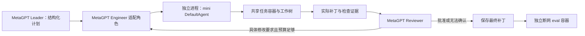

# SWE agent 迁移指南：EvoMAS → MetaGPT＋mini 的实现与复盘

记录日期：2026-09-18。面向把现有单体或多智能体项目接入 SWE-bench、SWE-bench Pro 的工程迁移。

这次最有价值的经验是：**先验证“任务进入模型 → 容器执行 → 修改留在工作树 → 补丁正确回收 → 独立 eval”这条链路，再评价 agent 和协作能力。** 接入 mini-swe-agent 能复用编码执行循环，但不会自动解决角色交接、预算、容器兼容性或实验污染。

本文把“已实现并验证”“仅在小样本观察到”“仍需完善”分开。当前四域 216 题正在运行，尚无全量最终结论；本文不会把诊断样本的通过率当作总体收益。

## 1. 迁移后实际验证的架构



| 层次 | 本项目实现 | 可复用边界 |
| --- | --- | --- |
| 编码执行器 | 已安装的 `minisweagent.agents.default.DefaultAgent`、`LitellmModel` | 尽量复用成熟的工具调用、动作执行和轨迹管理 |
| 编码适配层 | MetaGPT `SWEMiniEngineer` 启动 worker | 负责输入、阶段预算、取消、补丁采集和框架状态衔接 |
| 协作层 | MetaGPT Team、角色消息、共享状态、Leader、Reviewer | 负责分工、计划、审查、返工和终止 |
| 运行环境 | 全角色访问同一个任务 Docker 容器 | 保证工作目录、文件版本、环境和补丁一致 |
| 评估层 | 单独启动 eval 容器，应用预测补丁和评估测试 | 不以 agent 自述或 Reviewer 批准代替正式评分 |

这是 **MetaGPT 经 SWE 专项适配＋mini 编码后端**，不是三个仅换提示词的 mini，也不是完全未经改动的原版 MetaGPT。Leader/Reviewer 保留 MetaGPT 角色与消息路由，但使用简化的原生工具调用循环，绕过通用 RoleZero 的部分规划和文本动作流程。论文或报告应明确披露这些适配。

mini 使用当前安装包的实现，版本记录为 2.4.6，没有自行重写一个同名 DefaultAgent。安装包可能包含此前 EvoMAS 的本地修改，版本号不能证明源码与上游发行版完全一致。迁往其他项目时，应同时保存解释器、包版本、安装源码摘要和配置模板摘要；当前实验的源码 manifest 还没有完整覆盖所有第三方包。

本机 MetaGPT 使用 Python 3.9，mini 使用 Python 3.11。独立进程隔离了依赖冲突，代价是必须显式处理进程退出、超时、状态传递和日志合并。评估也使用独立 Python 环境；评估脚本不能因为导入一个小工具函数而触发整个 MetaGPT 的依赖链。

## 2. 已落地的改动与代码入口

| 改动 | 解决的问题 | 主要入口 |
| --- | --- | --- |
| mini worker 接入共享容器 | 本地编码执行器不稳定；Python 依赖冲突 | [swe_mini_engineer.py](../metagpt/roles/di/swe_mini_engineer.py)、[swe_mini_worker.py](../metagpt/roles/di/swe_mini_worker.py) |
| 持久保存角色交接和反馈 | 框架投递成功，但后续模型没有收到内容 | [swe_protocol.py](../metagpt/roles/di/swe_protocol.py) |
| Leader 强制输出结构化计划 | 探索触顶后只转发原始观察，或把猜测路径说成已确认 | [swe_team_leader.py](../metagpt/roles/di/swe_team_leader.py) |
| Reviewer 简化请求与三类结论 | 上下文重复、审查超时、超时被误当作代码缺陷 | [reviewer.py](../metagpt/roles/di/reviewer.py)、[swe_role_tools.py](../metagpt/roles/di/swe_role_tools.py) |
| 统一 shell、兼容 BusyBox | 同容器不同角色找不到 Go；heredoc 被破坏；timeout 参数不通用 | [swe_shell.py](../metagpt/roles/di/swe_shell.py)、[docker_terminal.py](../metagpt/tools/libs/docker_terminal.py)、[docker_bash.py](../metagpt/tools/libs/docker_bash.py) |
| 独立回收实际工作树补丁 | shell 取消后回收空输出；新增文件遗漏；镜像初始差异混入 | [docker_bash.py](../metagpt/tools/libs/docker_bash.py)、[生成 runner](../tests/metagpt/roles/di/run_swe_agent_for_benchmark.py) |
| 测试包装与证据快照 | pipeline 隐藏失败、零测试误判通过、旧失败丢失 | [swe_checks.py](../metagpt/roles/di/swe_checks.py)、[swe_protocol.py](../metagpt/roles/di/swe_protocol.py) |
| 独立角色预算 | 思考 token 耗尽输出额度；没有时间形成审查或返工 | [swe_budget.py](../metagpt/roles/di/swe_budget.py) |
| 容器断网和 Git 对象隔离 | 在线找答案；离线读取未来提交、目标源码和测试 | [swe_container.py](../metagpt/roles/di/swe_container.py)、[swe_repository.py](../metagpt/roles/di/swe_repository.py) |
| 全量多域调度、源码指纹和恢复 | 任务漏跑、版本混用、重复生成、错误类型混算 | [全量控制器](../tests/metagpt/roles/di/run_swe_full_experiment.py)、[eval runner](../tests/metagpt/roles/di/run_swebench_pro_eval.py) |

其他框架优先移植“执行适配、共享状态和评估边界”。角色身份、路由机制仍使用目标框架自身实现，才能讨论该框架的协作效果。

## 3. 执行与补丁：遇到的问题及验证办法

| 实际踩坑 | 原因与修复 | 迁移时如何验证 |
| --- | --- | --- |
| mini 能运行 Go，Reviewer 却找不到 Go | `bash -c` 与 `bash -lc` 初始化环境不同；统一工具 shell，并显式指定 `BASH_ENV=/root/.bashrc` | 同一容器让各执行端分别查找并运行目标工具，不能只检查宿主机 PATH |
| 合法 Python heredoc 变成 SyntaxError | 在结束分隔符后拼了 `&& echo ...`；直接执行完整原命令，必要的状态标记使用独立新行 | 执行多行 heredoc，检查内容、退出码和 shell 是否仍可用 |
| 停止 agent 后明明有修改，却提交空 patch | 复用被取消、阻塞或带残留输出的交互 shell | 用独立 Docker exec 回收补丁，并检查采集命令退出码；失败要报错，不能默认为空 |
| 新文件没有进入补丁 | `git diff` 默认不包含 untracked 文件 | 在一次性任务容器中纳入新文件后采集，测试新增文件、已跟踪修改、删除文件 |
| patch 里只有 Selenium 等无关兼容改动 | 镜像在启动时就有脏工作区，agent 没有实施任务修改 | 记录初始文件级 diff，仅过滤仍逐字相同的初始差异；agent 改过的文件保留完整 diff |
| `patch.txt` 被当作源码提交 | mini 的补丁传输文件留在仓库 | 从采集范围排除传输文件；不能用它替代最终实际工作树 |
| WebClients 在模型调用前失败 | Alpine/BusyBox 不支持 `timeout --kill-after=2` | 使用经 GNU/BusyBox 实测的 `timeout -k 2`；同时覆盖普通工具执行和独立补丁采集路径 |

**“同样是 Docker”不代表 shell 工具一致。** 四域真实检查观察到超时退出码既有 124，也有 143；应结合调用超时事实与工具实现解释，不能把单一退出码当作所有镜像的通用超时协议。当前检查分类对某些 BusyBox 超时仍可能显示一般命令失败，尚未做全面归一化。

镜像初始差异也可能很大：本轮预检的一个 OpenLibrary 镜像有约 264k 字符，一个 WebClients 镜像约 71k 字符。不能用“补丁不为空”证明 agent 完成了有效修改，也不能盲目 reset 工作树把镜像预装的兼容修复清掉。当前按文件级原始 diff 是否完全相同做过滤；它不是任意脏工作区的精确语义减法。

最后一次跨域故障还说明：**shell 冒烟通过，不等于提交链路通过。** 两条 timeout 路径曾分两次才发现问题。迁移验收必须执行到“创建文件 → 采集 patch → 独立 eval”，并覆盖每种基础镜像家族。

## 4. 协作：消息、计划、证据和状态必须一起迁移

### 4.1 检查真正发给模型的请求

MetaGPT 中 Leader 发给 Engineer 的消息曾能触发角色运行，却没有进入编码模型的实际请求。解决办法是把交接写入独立共享状态，在原生 Engineer 和 mini 的输入构造中显式读取，而非依赖消息队列或短期记忆碰巧保留。

验收时使用一个唯一标记：发出交接，再确认它确实出现在后续模型请求里；记忆被裁剪后仍应有效。返工反馈也做同样验证。日志里写了“交接成功”，只能证明某层代码执行过。

### 4.2 Leader 交付物应可执行

当前计划字段为 `locations / hypothesis / steps / verification / unknowns`。探索超时、动作数量触顶、批量调用超限等出口都应进入同一个计划收尾步骤。

不要从 grep 输出里出现某个路径，就自动宣布它是必须修改的文件。也不要把“未知但看起来合理”写成已验证事实。结构化输出解决了传递形态，尚未保证内容准确：本轮占位符任务的 Leader 仍猜错初始位置；还有一次 unknowns 被模型输出成字符串而非数组，说明字段类型校验仍需完善。

### 4.3 提交的是工作树和证据，不只是“我完成了”

建议的最小提交契约与本项目当前字段一致：

```text
submission_id
patch_digest
patch                  # 来自实际工作树；截断需明确标识
reason                 # 主动提交、阶段超时或执行异常
checks[]               # 命令、退出码、输出摘要、证据分类、对应 tree hash
recent_actions[]       # 少量非重复上下文
```

Reviewer 收到一次公开任务和当前快照即可，避免同一 packet 同时重复进入系统提示、消息历史、planner goal；packet 本身也不要再重复收录输出整个 diff 的命令。

失败证据不能因为后面执行了十几条 `cat` 就消失。当前实现按检查命令去重，优先保留最近 6 条非通过证据和 3 条通过证据，并带工作树摘要。它仍是有限窗口，不是完整的缺陷追踪系统。评审时应解释失败属于旧版本、旧预期还是当前真实缺陷，而非把任何历史失败都判成当前错误。

### 4.4 审查至少需要三种状态

| 状态 | 含义 | 当前处理 |
| --- | --- | --- |
| approved | 基于已有证据接受补丁 | 保存并结束；是否得分仍看 eval |
| changes_requested | 有具体文件、行为和证据支持的修改要求 | 持久保存反馈，预算足够才进入返工 |
| inconclusive | 没有完成判断，或依据不足 | 保留当前补丁结束，不凭空消耗返工轮次 |

此前把审查超时当成拒绝，导致已经通过的补丁反复提交，digest 一直不变。现在同时检查“补丁＋所选检查证据”是否变化，并在没有返工预算时直接结束；只有提交次数增加，不代表发生了有效协作。

本轮 gRPC 的结构化状态为 inconclusive，说明文字却以 changes_requested 开头，仍存在状态与措辞不一致。框架按结构化状态执行是可解释的，但还应完善输出一致性校验。Reviewer 的 read/check 名称和提示约束也不等于操作系统强制只读；当前工具层未建立完整的只读权限边界。

## 5. 验证：命令执行成功、测试通过和任务通过是三件事

`pytest ... | tail` 可能返回 tail 的 0；`go test ... | head` 在 pipefail 下又可能因 SIGPIPE 返回 141。修复方法是：**先完整保存实际测试输出及退出码，再显示裁剪后的日志**。当前 `swe-check` 执行这一包装。

检查结论至少区分：明确测试通过、明确失败、没有测试执行、命令/环境失败、超时、证据不足。分类是辅助观察，不能替代语义判断。`no tests to run` 即使旁边出现 PASS，也不能证明新功能被验证；一次 build 成功同样不能证明需求已经实现。

还有两类容易误判的实际案例：

- MARC 修改让语言从一种变为多种，旧 fixture 因此出现 3 个失败；符合公开新需求的补丁仍通过独立 eval。应解释预期变化，而不是修改测试以制造绿灯，也不是看到失败就机械返工。
- gRPC 的 eval 测试引用了补丁未定义的项目私有变量。**这是本轮补丁未通过 eval，不是容器少装了依赖。** 环境完备并不保证 agent 的源码符合测试。该题照实计为失败；不能把已看到的隐藏名称或参考值回填到后续生成提示词再宣称正常通过。

判定根因时同时查看预测补丁、应用日志、编译/测试输出和汇总报告。曾遇到补丁实际经后备方式应用成功，而报告字段仍看起来像“未应用”的情况；单个布尔字段不足以定位故障。

## 6. 预算：思考 token 和输出共用额度，时间要覆盖整个阶段

此前协调角色写死 `min(1536, 全局上限)`，所以单独调大启动参数并不会增加其额度。MARC 一次响应中 1536 个 completion token 全部记为 reasoning，最终工具调用尚未产出就被截断；重试再碰到 45 秒审查上限。

现改为独立参数：

| 参数（对照/全量入口） | 当前默认值 |
| --- | ---: |
| `--minutes` | 20 |
| `--max-tokens`，Engineer | 16384 |
| `--leader-max-tokens` | 16384 |
| `--reviewer-max-tokens` | 16384 |
| `--leader-seconds` | 180 |
| `--reviewer-seconds` | 180 |
| `--first-edit-fraction` | 0.6 |

默认最迟时间分配：Leader 到第 3 分钟，首次编码到第 12 分钟，首次审查到第 15 分钟，返工到第 17 分钟，最终审查到第 20 分钟。阶段可提前结束；总预算不含初始化和正式 eval。Leader/Reviewer 各给最终计划或判定预留一半阶段时间，模型 HTTP 超时同步使用本次剩余预算。

这是当前实验起点，不是经全量调参证明的最优值。没有独立设置服务商专属 reasoning_effort，也没有承诺每次实际输出 16384 tokens。

新预算下 MARC 审查用时约 63 秒，最终一次输出 1794 tokens，其中 reasoning 1464，正常完成批准；三题均无审查输出截断或超时。**有证据说明旧上限会挡住这次审查，但三题通过数仍是 2/3，不能据此声称准确率提升。** 同时改变了时间、输出上限和阶段比例，也不能把收益单独归因于其中一个参数。

mini 仍可能长时间探索、反复寻找要求新增的函数，或在针对性检查完成后继续操作。本轮 MARC、gRPC 都耗尽了首次 12 分钟编码窗口才被收集补丁。长预算解除过早终止，不等于解决主动实施和收尾策略。

## 7. 实验可信度：断网之外还要切断答案来源

生成和 eval 均使用 `network=none`，执行前校验 Docker 的实际网络模式；模型 API 请求留在宿主机，agent 工具仍在任务容器内。不能只在提示词里写“不要联网”，也不能让自动安装依赖的流程悄悄恢复网络。

但断网仍不足够：pro7 中 agent 从镜像的本地 Git 未来历史读到了目标实现和测试，原始 3/3 因此作废。当前生成侧建立仅含基准提交的浅对象库，保留 SHA 与工作树，并移除旧对象数据库；仅删除分支或 refs，仍可能按已知 SHA 找到未来对象。

移除 `.git` 时还踩到子模块问题：OpenLibrary 的子模块 gitfile 指向主仓库 `.git/modules`，直接替换主仓库会令它们失效。当前按最深层开始将已初始化子模块转成独立浅仓库，再处理主仓库。应验证原始 SHA、脏工作区、子模块和 Git 操作都保留，未来对象不可读。

eval 与生成的 Git 策略不同：eval 必须能加载评估测试，但不把参考生产代码应用到 agent 补丁中。评估输入可以在宿主机保存原始元数据，生成请求只拼公开字段。不要把输入 JSONL、隐藏测试或评估报告挂载到 agent 可访问的位置。

这些措施减少了已观察到的答案泄漏路径，不构成“完全杜绝 reward hacking”的证明。镜像工作树中的额外答案文件、依赖缓存、测试修改、其他可读资源和工具权限仍应按实际环境审计。不能因为关闭网络，就省略这些边界检查。

## 8. 观测与长时间运行

事件至少覆盖：任务与配置、断网校验、历史隔离、计划交接、实际模型请求、响应结束原因、动作输出和退出码、工作树变化、提交、审查结论、取消和最终评分。

| 观测陷阱 | 本次处理与限制 |
| --- | --- |
| usage=0 被理解成没调用或免费 | 协调角色改用可返回 usage 的非流式工具接口；记录请求、响应及中断。未完成请求可能没有 usage，不能拿记录之和当准确账单 |
| 模型调用慢被直接归因于思考 | 记录的是整次调用耗时，包含服务排队、传输等；没有独立首 token 延迟，不能精确分摊 |
| retry 配置为 0 就以为不会重试 | LiteLLM 和上层 agent 可能各有重试；记录异常类型与请求次数，区分临时限流和凭据/额度失效 |
| 异常日志泄露认证信息 | 结构化轨迹仅记录模型异常类型；上游原始日志仍可能含敏感字段，分享前需脱敏，不能因为自建事件干净就认定所有日志安全 |
| 运行中修改代码，后续任务混用新版本 | 保存源码摘要和副本，控制器启动任务/评估前校验；不匹配就停止调度。修改说明文档不需要改变实验代码 |

当前全量调度采用每域顺序执行、四域并行，eval 使用独立信号量最多两个并发；参数来自当前机器资源和限流情况，并非通用最优并发。实例输出各自独立，避免多个进程覆盖同一个预测文件。

结果必须区分 setup_error、generation_error、eval 异常、空补丁、unresolved 和 resolved。初始化问题可修复后用新版本重跑，但必须保留原尝试及选择规则；**全量分母仍是计划的 216 个任务，不能删除错误任务来抬高通过率。** 本次前两次因 BusyBox 故障中止的启动单独归档，正式成绩只使用 v3 目录。

## 9. 迁往其他项目的执行顺序

1. **固定实验契约。** 明确数据集与 split、模型、预算、镜像、公开字段、最终评分方式。先冻结输入和源码版本，不从“通过样本”里继续挑选好看的结果。
2. **先跑通编码后端。** 在目标框架中接入 mini，测试宿主机 API→worker→容器→文件修改→补丁回收。再跑一个真实任务，确认不是只通过模拟模型。
3. **覆盖全部镜像家族。** 对 Python、Go、Node/Alpine 等实际镜像逐一验证 PATH、heredoc、退出码、超时、初始脏工作区、新文件采集、子模块及容器清理。只测 Python 镜像不够。
4. **加入角色协作。** 验证计划与反馈进入真正的模型请求；统一提交快照；用 approved/changes_requested/inconclusive 驱动状态机。返工测试要验证真的修改了代码，而非仅增加 submission_id。
5. **验证实验隔离。** 检查生成和 eval 的实际网络模式、未来 Git 对象、挂载、公开输入边界。用独立 eval 验证补丁，不向 agent 提供隐藏失败细节作为下一轮解题提示。
6. **做小样本诊断与消融。** 比较单 mini 与团队 mini；保持模型、任务、工具、环境和整个任务预算一致，另外报告 token 与耗时。若同时换执行器和协作拓扑，就不能把差异都归因于协作。
7. **再启动全量。** 使用新目录、完整预定清单、分域并发、独立 eval、持久进度、严格恢复规则。观察每个域的首个真实任务越过初始化并进入模型调用，再交给后台持续执行。

进入全量前的最低验收项：

- [ ] 每种镜像都通过实际 shell、修改、新文件 patch 采集检查。
- [ ] 同一交接标记能在下游模型请求中找到；当前 packet 不重复堆叠。
- [ ] 超时后仍能回收已存在的补丁，采集错误不会被伪装为空。
- [ ] 明确失败、零测试与管道状态都能被如实记录。
- [ ] 同补丁且无新证据不会重复审查，无返工预算不会重新提交。
- [ ] 输出 token 和阶段时间独立配置，实际请求与配置一致。
- [ ] 容器实际断网，未来 Git 对象不可读，初始化不会破坏子模块。
- [ ] 独立 eval 能正确区分一份已知通过补丁和一份失败补丁。
- [ ] 重启不会重复生成已完成任务；源码不一致不会继续混跑。

其中“已知通过补丁”只用于评估器验收；不得作为 agent 生成输入。

## 10. 可复用经验与当前证据边界

| 观察 | 能支持的结论 | 不能支持的结论 |
| --- | --- | --- |
| pro5 单 mini 2/3、原生单体 1/3、团队 mini 0/3 | 值得定位执行与交接问题；这些是历史诊断数据 | 某框架普遍优于另一个框架，或 mini 必然更强 |
| pro6 修复后团队 2/3，但审查仍超时 | 工程链路改善后可以产出有效补丁 | 两道通过题必然受益于 Reviewer |
| pro7 原始 3/3，但读到未来 Git 历史 | 必须把本地答案泄漏纳入防护 | 这轮可以作为有效成绩 |
| pro8 隔离历史后 2/3 | 两道任务在受限生成环境中通过独立 eval | 三题足以验证多智能体增益 |
| pro9 新预算 2/3，审查均无截断/超时 | 新预算让这次 MARC 审查完整执行 | 准确率已经提升或返工闭环已验证 |
| 四域预检、回归测试通过，216 题已启动 | 全量运行的基础设施已完成这些检查 | 全量最终通过率已知或所有镜像都绝无例外 |

最应优先迁移的是稳定的执行与采集协议、明确的跨角色证据、合理且可观测的预算、以及可信的独立评估。提示词微调和协作拓扑比较应建立在这些基础上。

进一步核查：

- [配置与运行入口](SWE_mini_backend_migration.md)
- [三题最初失败分析](../workspace/pro5_mini_comparison_20260918/team_failure_analysis.md)
- [pro6 轨迹审计](../workspace/pro6_mini_team_20260918/trajectory_audit.md)
- [Git 历史泄漏记录](../workspace/pro7_mini_team_20260918/validity.json)
- [隔离后的 pro8 结果](../workspace/pro8_mini_team_clean_20260918/analysis.md)
- [新预算 pro9 对照](../workspace/pro9_mini_team_budget_20260918/analysis.md)
- [当前全量运行与实时进度](../workspace/pro10_mini_team_full_20260918_v3/README.md)
